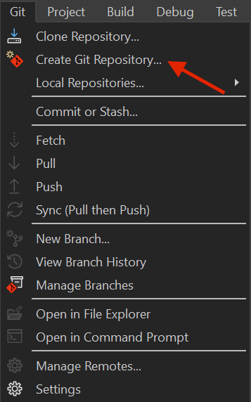
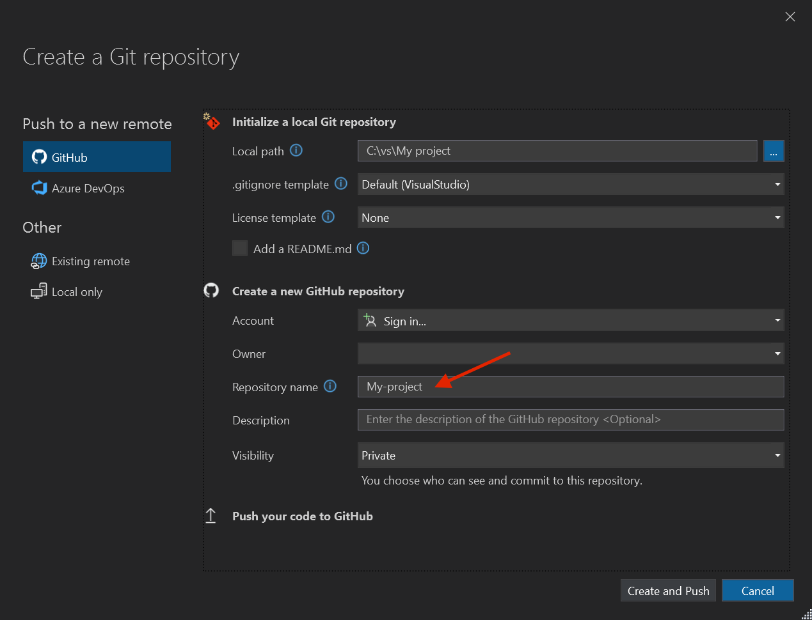
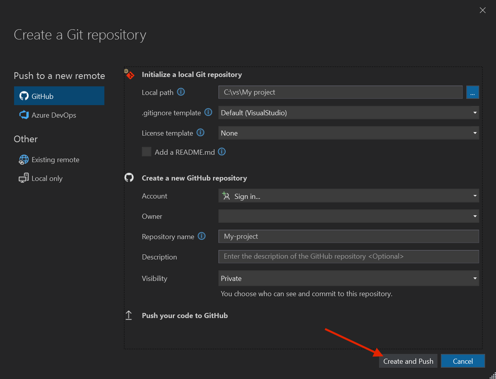
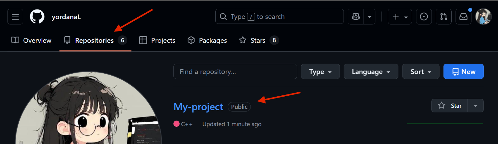
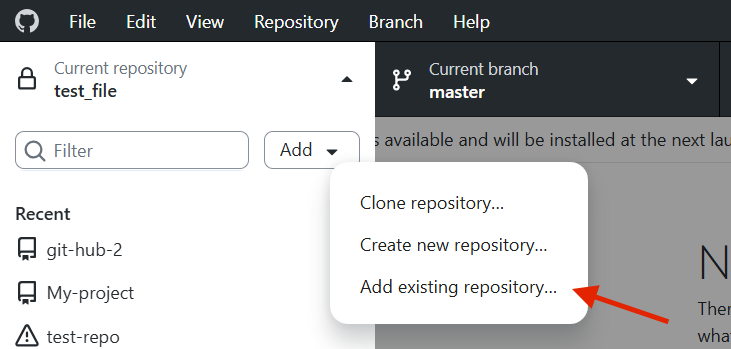
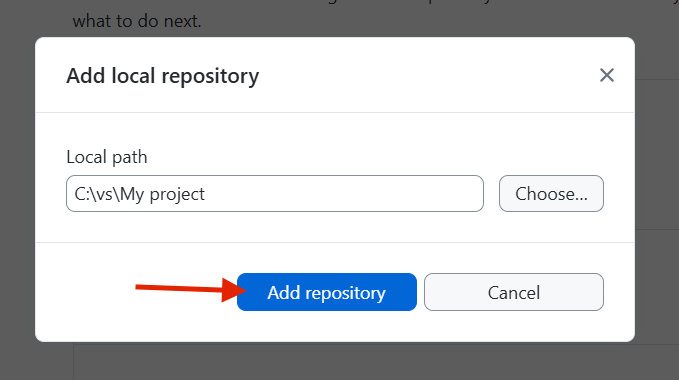

# Git Hub Tutorial (по-лесно за Visual Studio)

### 1. Инсталирайте GitHub Desktop
[GitHub Desktop Download](https://docs.github.com/en/desktop/installing-and-authenticating-to-github-desktop/installing-github-desktop)

### 2. Създайте нов проект във Visual Studio

### 3. В новия проект избирате Git от менюто 

### 4. Избирате Create Git Repository...

### 5. Добавяте README.md

### 6. Влизате с Git Hub акаунта си

### 7. Задавате име на своето repository

### 8. Добавяте описание на своето repository

### 9. Избирате дали да е public или private

### 10. Избирате Create and push

Като влезете в акауната си в Git Hub би трябвало да виждате новосъздаденото repository.

### 11. Отваряте си Git Hub Desktop

### 12. Избирате Current repository

### 13. Избирате Add

### 13. Избирате Add existing repository...

### 14. Избирате Choose и избирате папката на проекта ви

### 15. Добавяте repository

### 16. Правите си промени по кода и запазвате промените

### 17. Избирате кои от файловете да commit-нете

### 18. Добавяте име на commit

### 18. Добавяте описание на commit

### 19. Избирате Commit file to master

### 20. Избирате Push Origin

### 21. ГОТОВО!
