# Git Hub Tutorial

### 1. Инсталирайте GitHub Desktop
[GitHub Desktop Download](https://docs.github.com/en/desktop/installing-and-authenticating-to-github-desktop/installing-github-desktop)

### 2. Влизате в GitHub 

### 3. Създавате ново repository
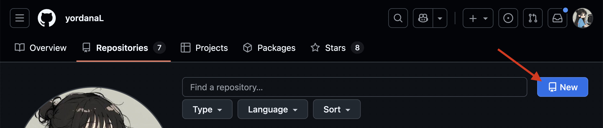

### 4. Задавате име на своето repository
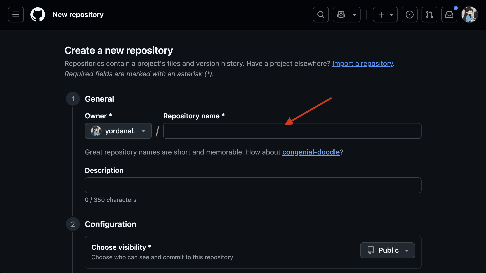

### 5. Добавяте описание на своето repository
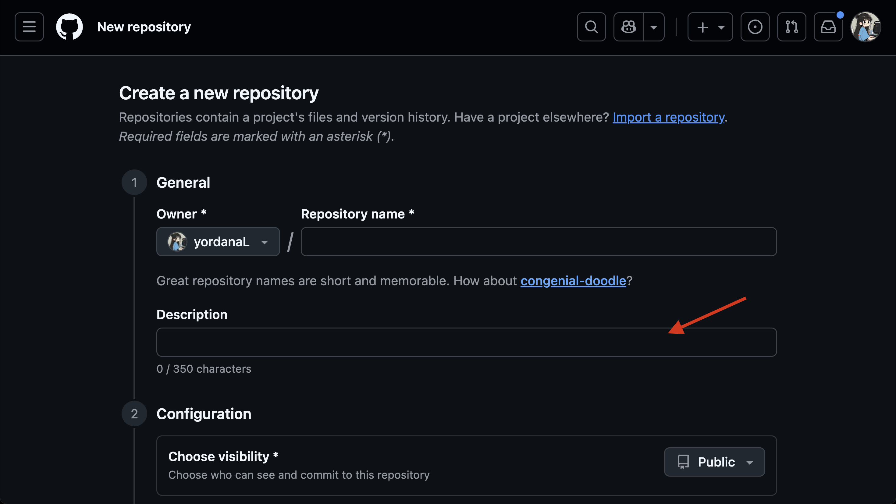

### 6. Избирате дали да е public или private
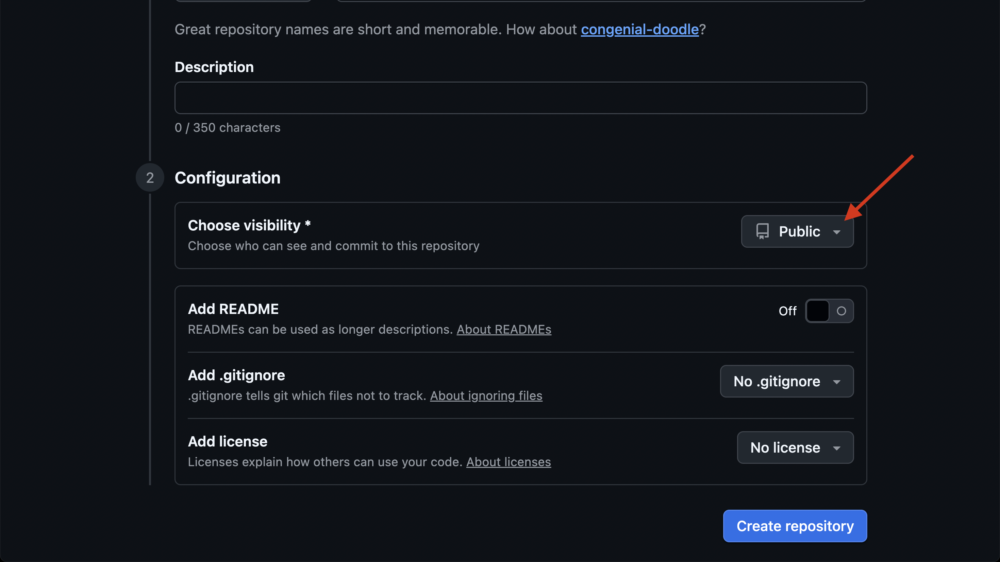

### 7. Добавяте README.md

### 8. Добавяте .gitignore (за Visual Studio - Visual Studio, за останалите - C++ или ако вие намерите по-подходящ)
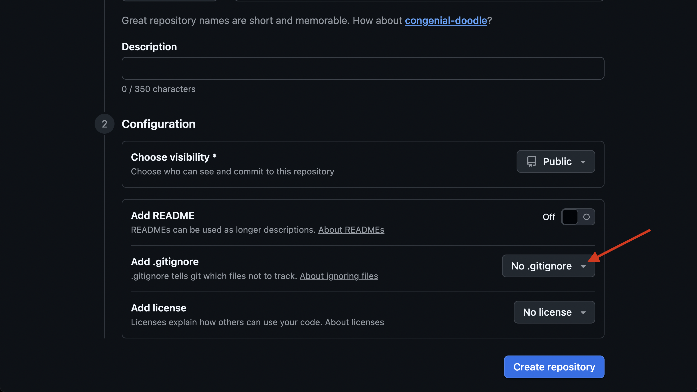

### 9. Изберете Create repository
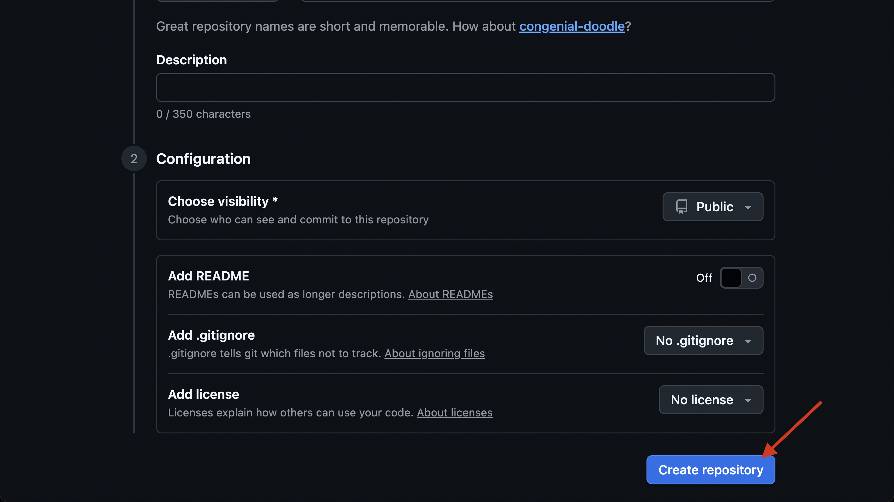

### 10. Влизате в новосъздаденото repository и избирате <>Code
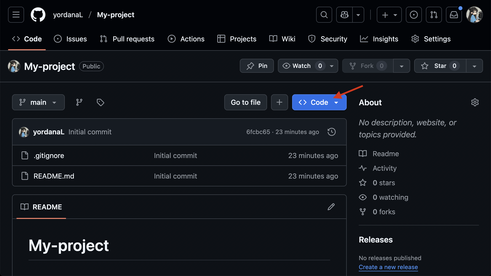

### 11. Копирате връзката
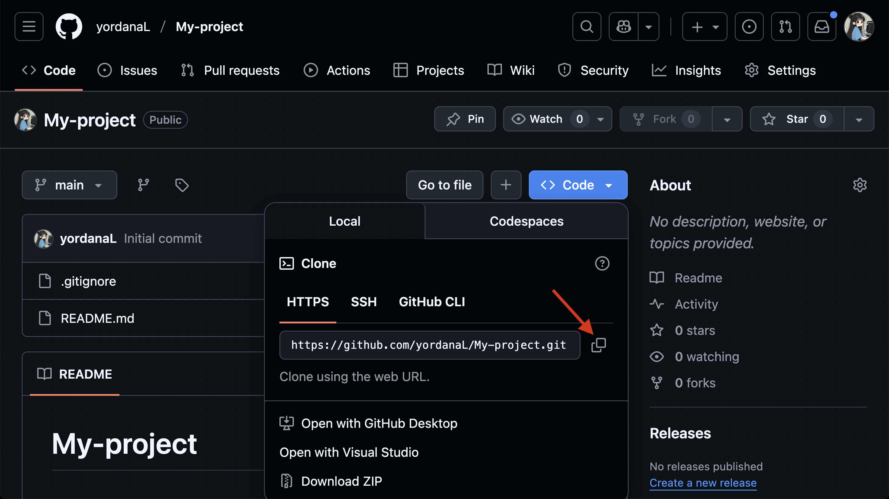

### 12. Отваряте си Git Hub Desktop

### 13. Избирате Current repository
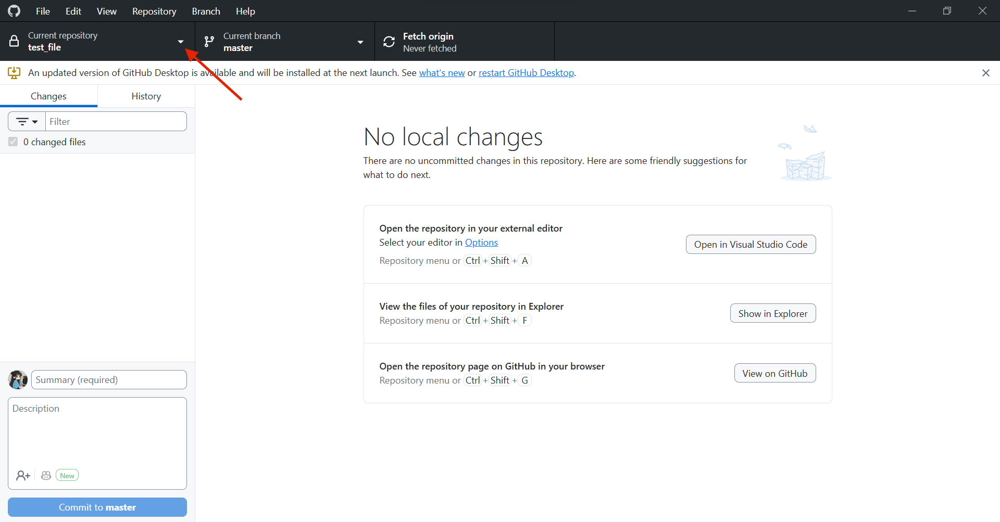

### 14. Избирате Add
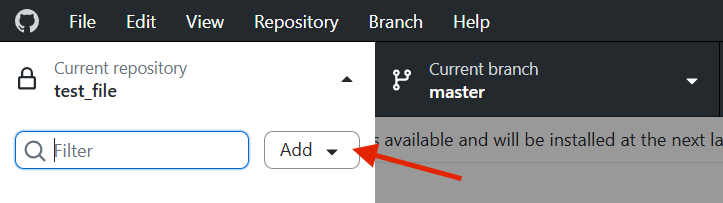

### 15. Избирате Clone repository...
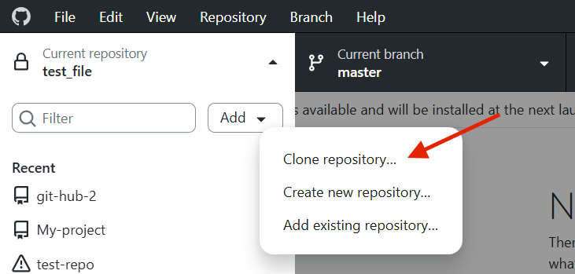

### 16. Избирате URL
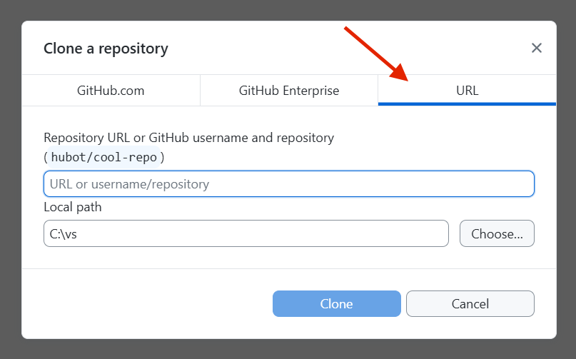

### 17. Поставяте връзката, която сте копирали от GitHub
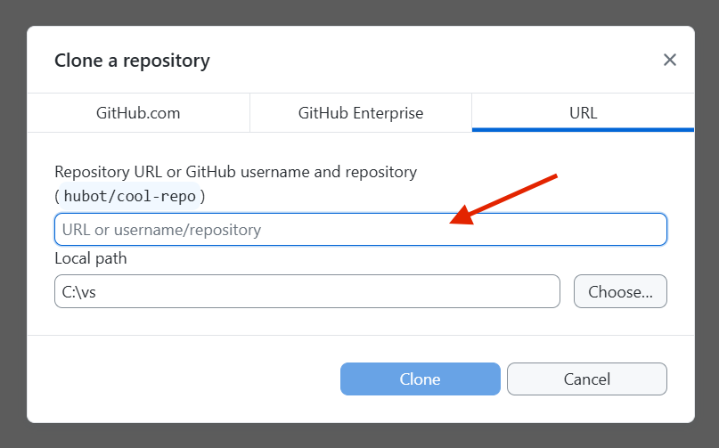

### 18. Избирате къде да ви се клонира repository-то
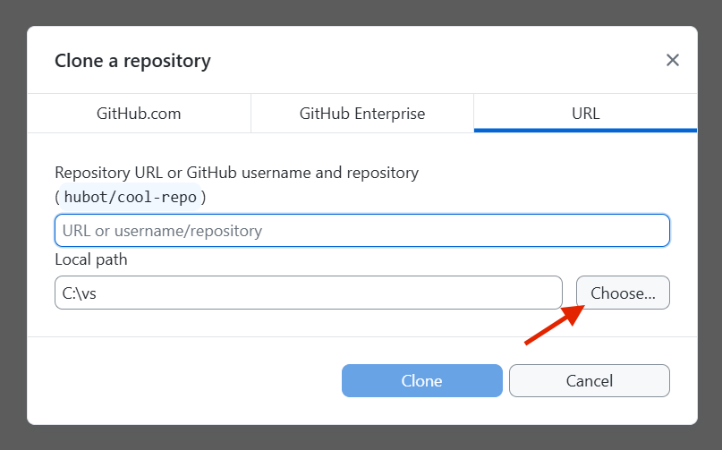

### 19. Избирате Clone
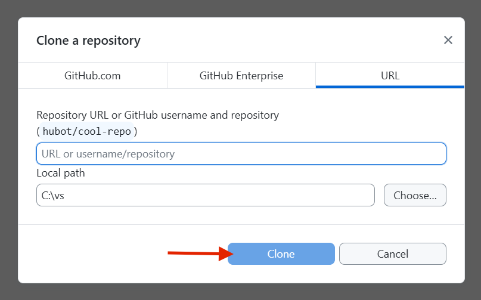

### 20. Правите си проект в папката на клонираното repository

### 21. Правите си промени по кода и запазвате промените

### 22. Избирате кои от файловете да commit-нете 
(обикновено се commit-ват .cpp, .h, .cs, .py, .js, .html, .css и други файлове с код, ако има такива, README.md, .sln, .vcxproj, .gitignore, .gitattributes ако има такива)

(обикновено не се commit-ват bin/, obj/ (папки с компилирани файлове), .exe, .dll, .pdb, .idb, .ilk, *.log, *.tlog, .suo, .user, .userosscache, .DS_Store (Mac), Thumbs.db (Windows))

### 23. Добавяте име на commit

### 24. Добавяте описание на commit

### 25. Избирате Commit file to master
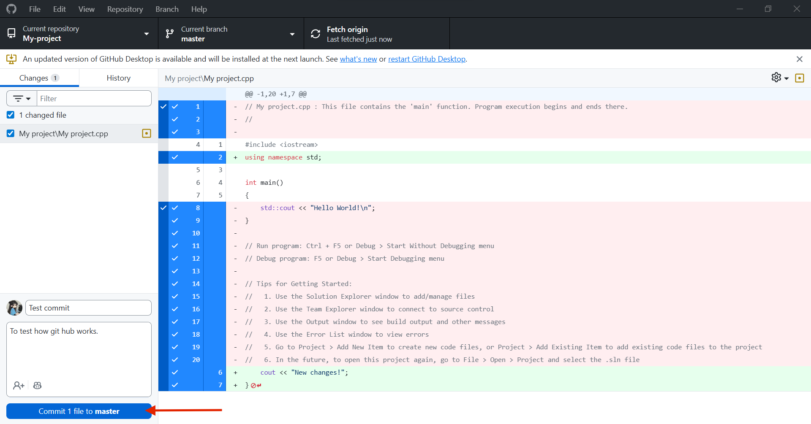

### 26. Избирате Push Origin
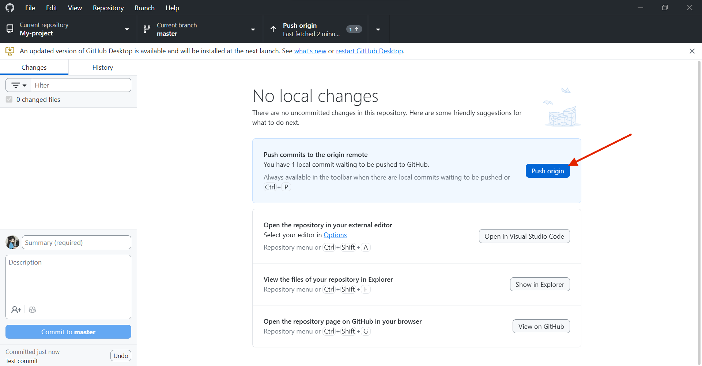

### 27. ГОТОВО!
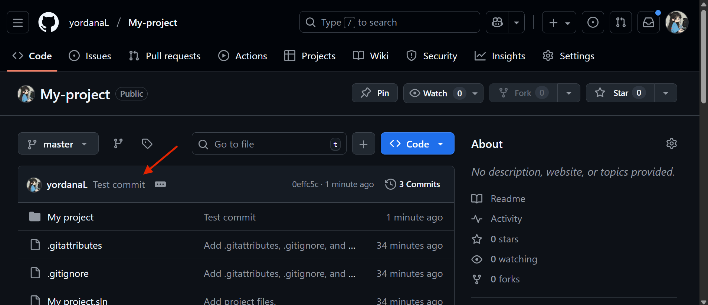